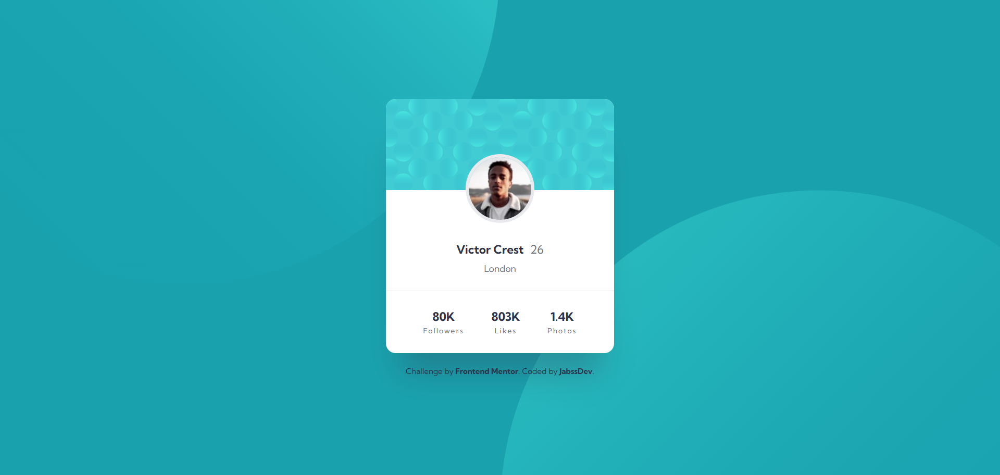

# Frontend Mentor - Profile card component solution

This is a solution to the [Profile card component challenge on Frontend Mentor](https://www.frontendmentor.io/challenges/profile-card-component-cfArpWshJ). Frontend Mentor challenges help you improve your coding skills by building realistic projects.

## Table of contents

- [Overview](#overview)
  - [The challenge](#the-challenge)
  - [Screenshot](#screenshot)
  - [Links](#links)
- [My process](#my-process)
  - [Built with](#built-with)
  - [What I learned](#what-i-learned)
  - [Continued development](#continued-development)
- [Author](#author)

## Overview

### The challenge

Users should be able to:

- View the optimal layout for the site depending on their device's screen size

### Screenshot



### Links

- Solution URL: [GitHub Repository](https://github.com/jabssdev/profile-card-component)
- Live Site URL: [Live Demo](https://jabssdev.github.io/profile-card-component/)

## My process

### Built with

- Semantic HTML5 markup
- CSS custom properties (Variables)
- Flexbox
- Mobile-first workflow
- **BEM Methodology** (Block Element Modifier)
- Modern CSS (Fluid Typography with `clamp`)

### What I learned

In this project, I reinforced my knowledge of component structuring and complex background management. My two main learnings were:

1. **BEM Methodology:** I learned to organize my CSS classes in a much more scalable and readable way. For example, the card structure:

```html
<main class="card">
	<header class="card__header">...</header>
	<section class="card__info">...</section>
	<ul class="card__stats">
		...
	</ul>
</main>
```

2. **Backgrounds without pseudo-elements:** I discovered that it is much cleaner and more efficient to position multiple background circles directly on the `body` using the `background-image` and `background-position` properties relative to the viewport, instead of resorting to `::before` and `::after` which can cause accidental scroll problems on mobile.

```css
body {
	background-image: url(images/bg-pattern-top.svg), url(images/bg-pattern-bottom.svg);
	background-color: var(--color-blue-600);
	background-repeat: no-repeat;
	background-position:
		right 50vw bottom 40vh,
		left 50vw top 40vh;
}
```

### Continued development

In future projects, I want to continue deepening my knowledge of **CSS Grid** for more complex layouts and explore subtle animations to improve the user experience (Micro-interactions).

## Author

- Frontend Mentor - [@jabssdev](https://www.frontendmentor.io/profile/jabssdev)
- GitHub - [JabssDev](https://github.com/jabssdev)
